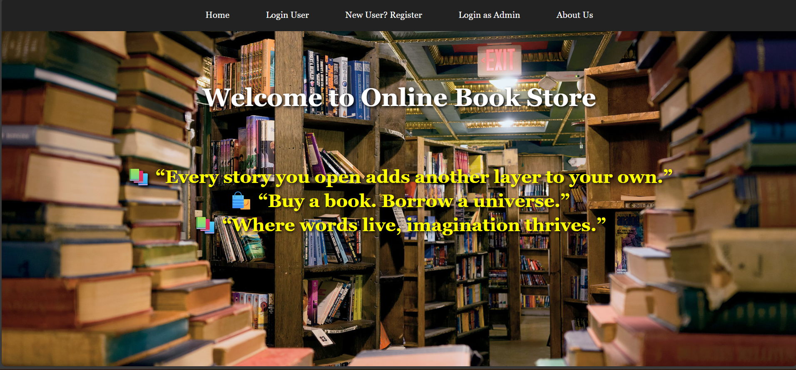
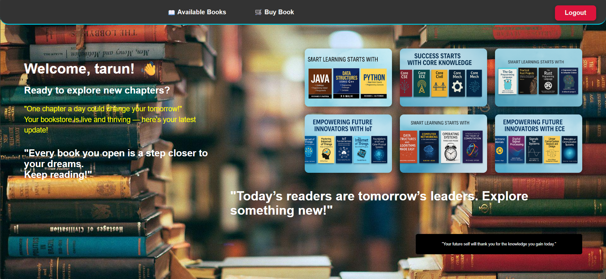
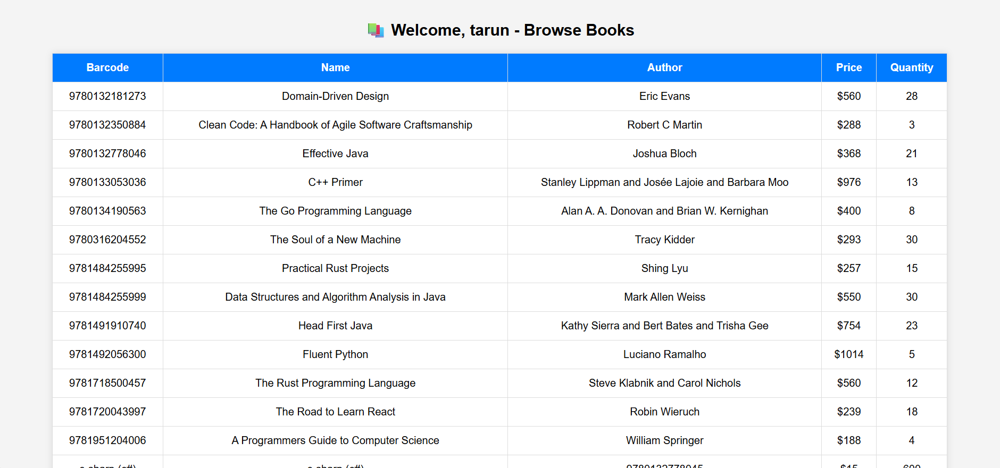
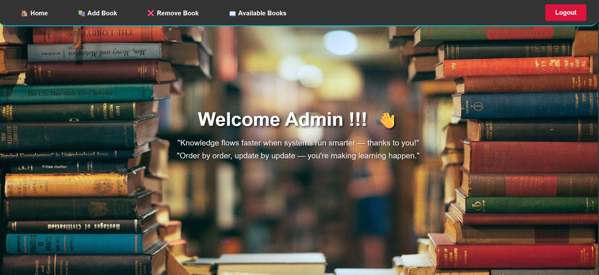
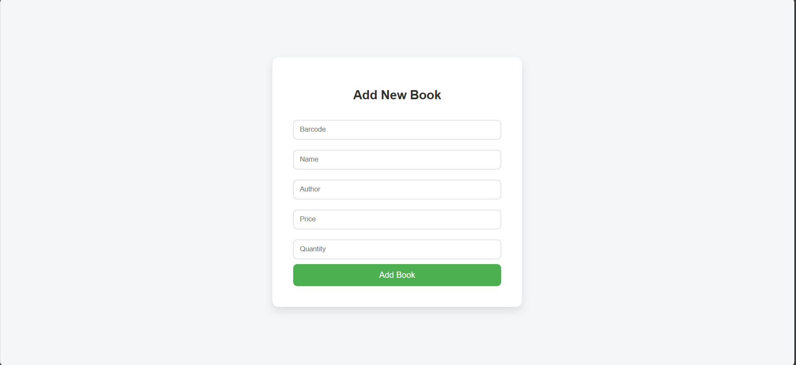
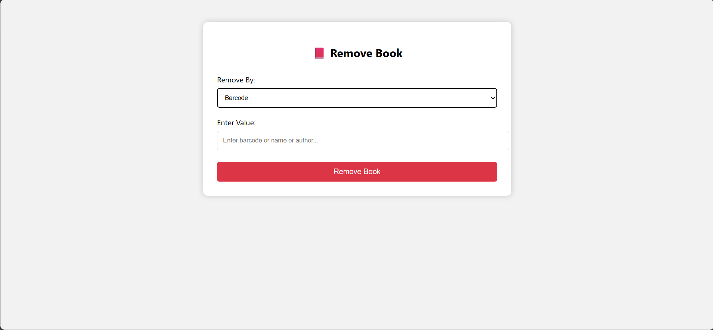
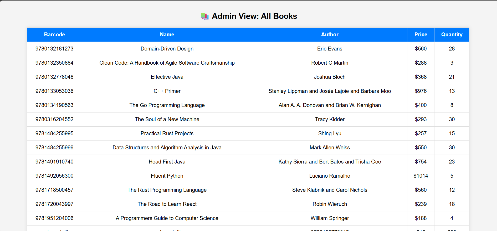

#  Online Book Store 
1. User Login Credentials: (tarun/tarun) || (username / password)

2. Admin Login Credentials: (admin/admin123)

# About 
A full-stack online book store project developed using JSP, Servlets, JDBC, MySQL, and Tomcat, enabling users to register, log in, browse books, add them to cart, and purchase. Admins can manage the book inventory (add, delete, view).

# This Website is built for following purpose:-

. For Selling books online.

. Maintaining books selling history.

. Adding and managing books.

. User Friendly.

. For Implementation of Http Servlets in Java.

# Admin Have Following Access for this online store site:-

. Add New Books.

. View Books Available.

. Remove Books.

. Increase Books Amount.

# Users Have Following Access for this online store site:-

. Create New Account or Register.

. Login.

. View Available Books.

. Select Books to Buy.

. Select Books Quantity.

. Buy Books.

. Get Payment Receipt.

#  Tech Stack Used :-

1. Front-End Development:

HTML

CSS

JSP

2. Back-End Development:
Java [JDK 8+]

JDBC

Servlet

3.Database:

MySql

4.Server:

Apache Tomcat

5.Tools : 	

 IDE - Eclipse EE
 
#  How to Setup and Run Locally
### Prerequisites:
.JDK 8 or above

.Apache Tomcat 9.0

.Eclipse EE or IntelliJ

.MySQL installed and running

#  Step-by-Step Installation:
1.Clone the Repository

git clone https://github.com/tarunnaik9/OnlineBookStore.git

2.Open in Eclipse EE

.File > Import > Dynamic Web Project

.Choose OnlineBookStore

3.Create MySQL Database (Dummy Database )

CREATE DATABASE onlinebookstore;

use onlinebookstore;

CREATE TABLE books (
  barcode VARCHAR(100) PRIMARY KEY,
  name VARCHAR(100),
  author VARCHAR(100),
  price INT,
  quantity INT
);

CREATE TABLE users (
  username VARCHAR(100) PRIMARY KEY,
  password VARCHAR(100),
  firstname VARCHAR(100),
  lastname VARCHAR(100),
  address TEXT,
  phone VARCHAR(100),
  mailid VARCHAR(100),
  usertype INT
);

INSERT INTO books VALUES

('9780134190563','The Go Programming Language','Alan A. A. Donovan and Brian W. Kernighan',400,8),

('9780133053036','C++ Primer','Stanley Lippman and Josée Lajoie and Barbara Moo',976,13),

('9781718500457','The Rust Programming Language','Steve Klabnik and Carol Nichols',560,12),

('9781491910740','Head First Java','Kathy Sierra and Bert Bates and Trisha Gee',754,23),

('9781492056300','Fluent Python','Luciano Ramalho',1014,5),

('9781720043997','The Road to Learn React','Robin Wieruch',239,18),

('9780132350884','Clean Code: A Handbook of Agile Software Craftsmanship','Robert C Martin',288,3),

('9780132181273','Domain-Driven Design','Eric Evans',560,28),

('9781951204006','A Programmers Guide to Computer Science','William Springer',188,4),

('9780316204552','The Soul of a New Machine','Tracy Kidder',293,30),

('9780132778046','Effective Java','Joshua Bloch',368,21),

('9781484255995','Practical Rust Projects','Shing Lyu',257,15);

SELECT COUNT(*) FROM books;

SELECT * FROM books;

INSERT INTO users VALUES

('demo','demo','Demo','User','Demo Home','42502216225','demo@gmail.com',2),

('Admin','Admin','Mr.','Admin','Haldia WB','9584552224521','admin@gmail.com',1),

('tarun','tarun','tarun','tarun','telangana','123456789','tarun@gmail.com',2);

4. Configure JDBC Connection

.DBConnection.java file must have:

String url = "jdbc:mysql://localhost:3306/bookstore";

String username = "root";

String password = "your-password";

5.Add Required JARs

mysql-connector.jar (for JDBC)

.Add to lib folder or classpath

6.Run on Tomcat

 Right click on project > Run As > Run on Server

7.Access in Browser

.Visit http://localhost:8081/onlinebookstore/

# Screenshots

# Future Enhancements
. Payment integration (Razorpay/Stripe)

. Email confirmation on registration

. JWT-based authentication
 
. Wishlist and Order history

. Mobile responsiveness

. Admin analytics panel

# Author
## Tarun Naik
 B.Tech – CSE (IoT) | Aspiring Software Engineer
 
 tarunnaikcloud@gmail.com

# License

This project is open-source and free to use.

